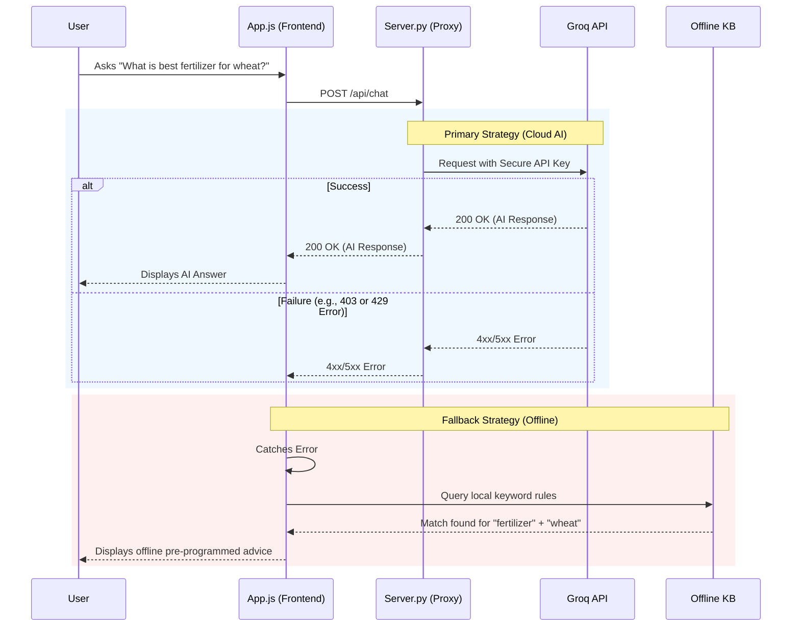

# 🌾 AgriProfit - Unbiased Advisory

AgriProfit is an interactive, completely unbiased AI crop advisory platform built to empower Indian farmers with scientific, brand-neutral agricultural knowledge. 

Unlike traditional agro-chemical retailers that heavily promote branded products, AgriProfit acts as an honest, philanthropic expert. It provides localized advice on pest management, soil health, crop cycles, and more, prioritizing organic methods and generic chemical formulations.

## 🚀 Key Features

* **🤖 AgriBot (AI Crop Advisor):** 
  * Powered by **Groq (Llama-3)** for lightning-fast, highly accurate responses.
  * **Seamless Offline Fallback:** If the API rate limits are hit or network connectivity drops, the chat automatically switches to a robust Offline Knowledge Base to ensure farmers always get answers without the UI crashing.
* **🚜 Traditional to Modern Farming Roadmap:** 
  * An interactive, 6-phase roadmap guiding farmers from traditional seed sowing to modern, data-driven post-harvest processing.
* **📍 Localized Context:** 
  * Personalized to the farmer's specific state, district, crop, and soil type.
* **🛡️ Secure Architecture:** 
  * API keys are shielded from the frontend through a lightweight Python proxy server.

## 🏗️ Architecture & Workflows

### 1. Secure AI Fallback Mechanism
To ensure 100% uptime, the AI chatbot utilizes a cascading fallback mechanism. If the primary cloud AI provider fails (due to rate limits, network issues, or revoked keys), it gracefully degrades to a local offline knowledge base.



### 2. User Journey Flowchart
The following flowchart illustrates the user's journey from landing on the application to receiving localized advisory.

```mermaid
flowchart TD
    Start([Launch AgriProfit]) --> Login{Is User Registered?}
    
    Login -->|No| Reg[Registration Screen]
    Reg --> Input[Input Name, State, District, Crop, Acres]
    Input --> Save[Save Profile to LocalStorage]
    Save --> Dash
    
    Login -->|Yes| Dash[Dashboard]
    
    Dash --> Chat[💬 Chat with AgriBot]
    Dash --> Roadmap[🚜 View Modern Farming Roadmap]
    Dash --> Weather[🌦️ Check Weather (Mocked)]
    Dash --> Academy[🎓 Read Agri-Academy Articles]
    
    Chat --> Localized[AI uses Profile Data for Context]
    Localized --> Advice[Receive Hyper-localized Advice]
```
## 🛠️ Tech Stack

* **Frontend:** Vanilla JavaScript, HTML5, CSS3.
* **Backend Proxy:** Python (`server.py`).
* **AI Engine:** Groq API (Primary), Gemini (Secondary Fallback), Hardcoded Knowledge Base (Tertiary Fallback).

## ⚙️ Running Locally

1. **Clone the repository**
   ```bash
   git clone https://github.com/bhatiiii0111-debug/Agri-Profit.git
   cd Agri-Profit
   ```

2. **Set up Environment Variables**
   Create a `.env` file in the root directory and add your Groq API key:
   ```env
   GROQ_API_KEY=your_groq_api_key_here
   ```

3. **Start the Proxy Server**
   Run the secure backend proxy server to handle API calls and serve static files:
   ```bash
   python server.py
   ```

4. **Access the App**
   Open your browser and navigate to:
   ```
   http://localhost:8080
   ```

## 🤝 Contribution
Developed with purpose by Harender Bhati to engineer technology for the prosperity of our farmers. 100% Free. 100% Unbiased.
