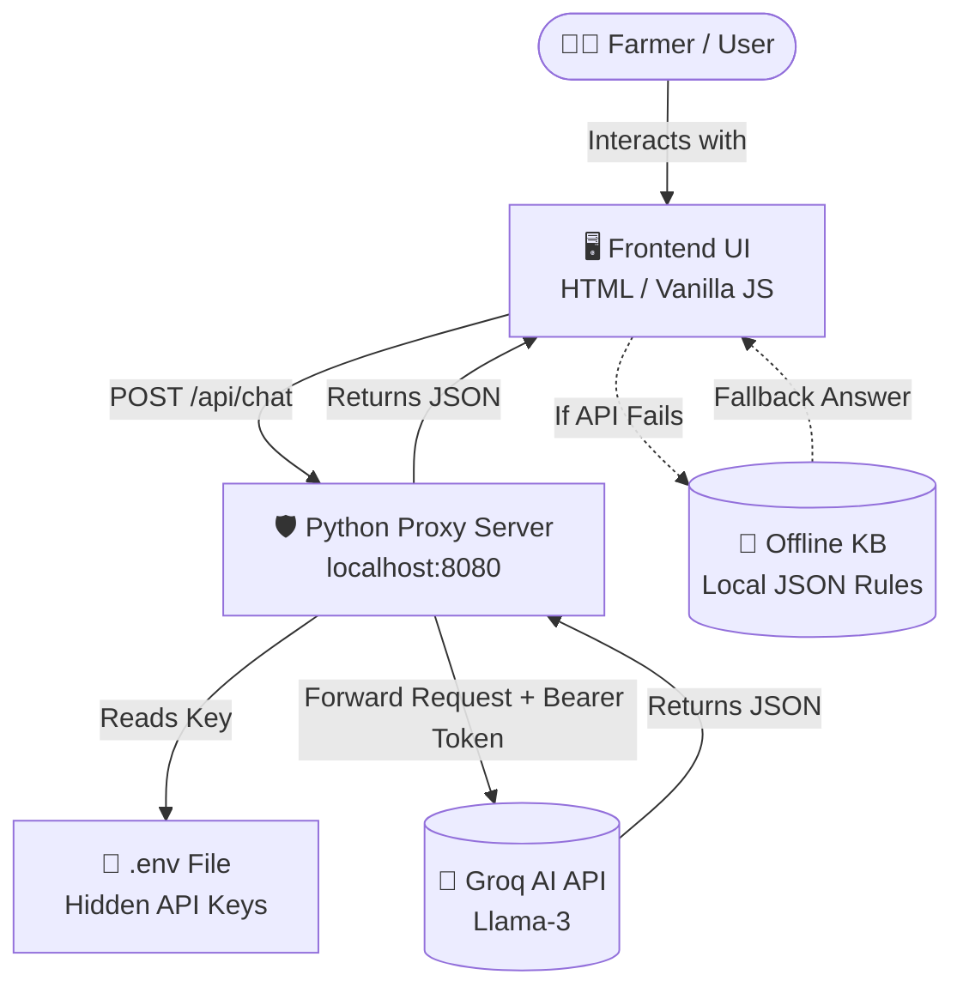
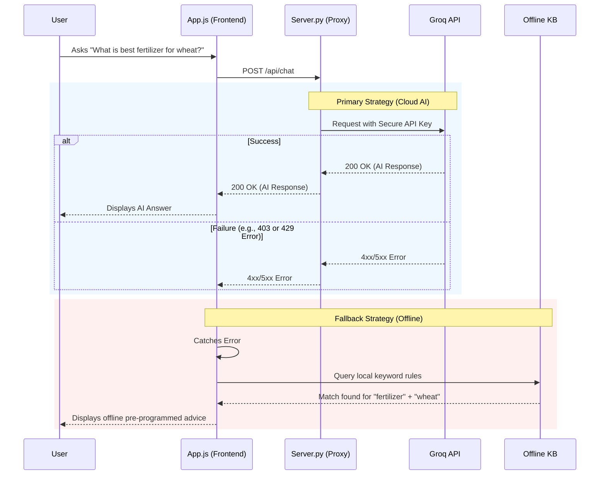

# 🏗️ AgriProfit Architecture & Workflows

This document outlines the core system architecture, data flow, and user workflows of the AgriProfit platform.

## 1. High-Level System Architecture

AgriProfit operates on a decoupled architecture where the frontend handles state and UI rendering, while a lightweight Python proxy server securely handles external API communications.



## 2. AgriBot AI Fallback Workflow

To ensure 100% uptime and reliability, the AI chatbot utilizes a cascading fallback mechanism. If the primary cloud AI provider fails (due to rate limits, network issues, or revoked keys), it gracefully degrades to a local offline knowledge base.



## 3. User Journey Workflow

The following flowchart illustrates the user's journey from landing on the application to receiving localized advisory.

```mermaid
flowchart TD
    Start([Launch AgriProfit]) --> Login{Is User Registered?}
    
    Login -->|No| Reg[Registration Screen]
    Reg --> Input[Input Name, State, District, Crop, Acres]
    Input --> Save[Save Profile to LocalStorage]
    Save --> Dash
    
    Login -->|Yes| Dash[Dashboard]
    
    Dash --> Chat[💬 Chat with AgriBot]
    Dash --> Roadmap[🚜 View Modern Farming Roadmap]
    Dash --> Weather[🌦️ Check Weather (Mocked)]
    Dash --> Academy[🎓 Read Agri-Academy Articles]
    
    Chat --> Localized[AI uses Profile Data for Context]
    Localized --> Advice[Receive Hyper-localized Advice]
```

## 4. Security Model

- **No Secrets in Browser:** The frontend JavaScript (`app.js`) contains absolutely zero API keys. 
- **Proxy Injection:** The Python `server.py` intercepts `/api/chat` requests, reads `GROQ_API_KEY` from the untracked `.env` file, and injects the `Authorization: Bearer` header server-side.
- **CORS & Access:** The proxy operates on the same origin (`localhost:8080`), avoiding complex CORS preflight issues while securing cross-origin requests to Groq.

